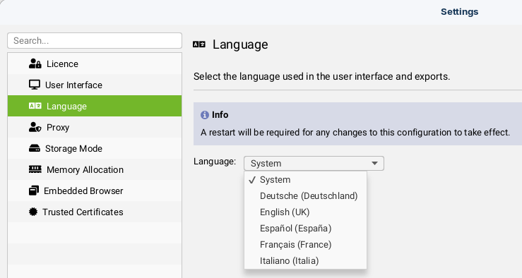
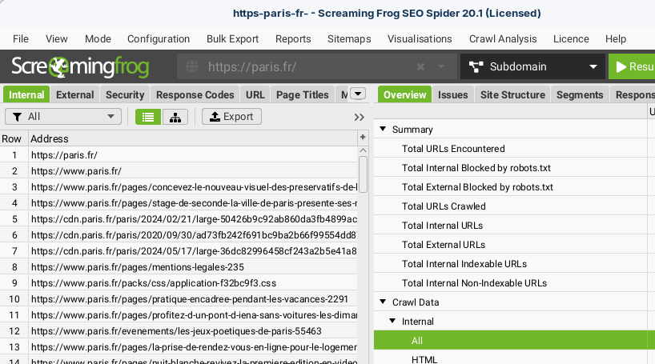
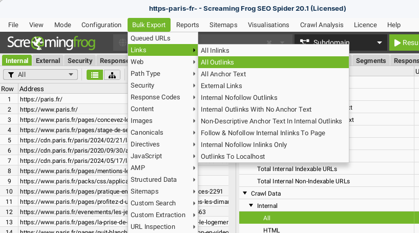
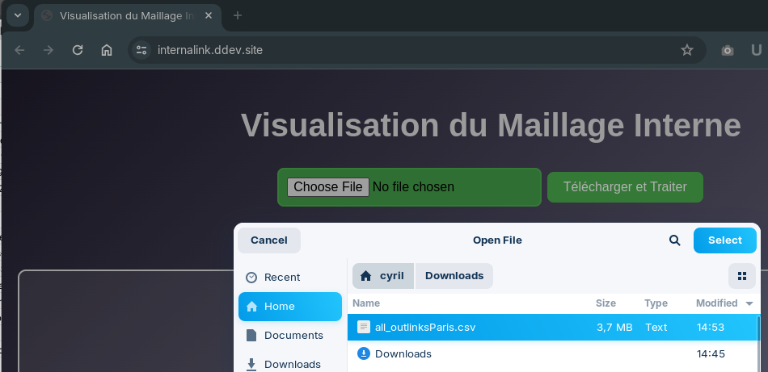
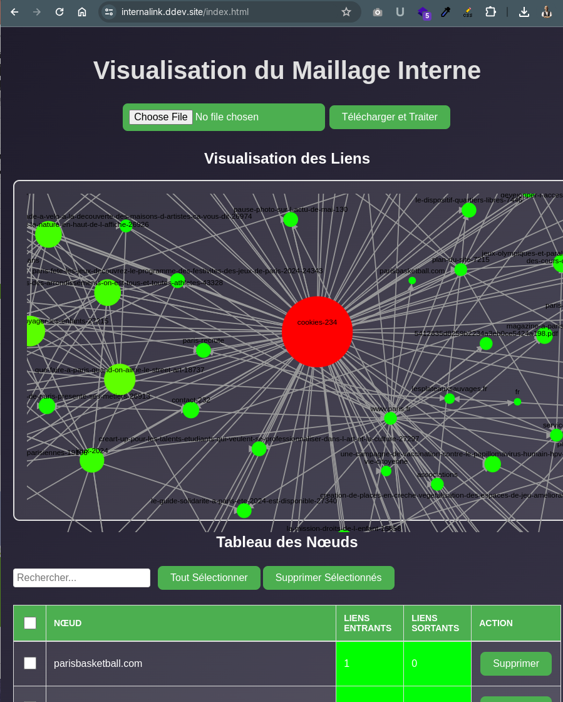
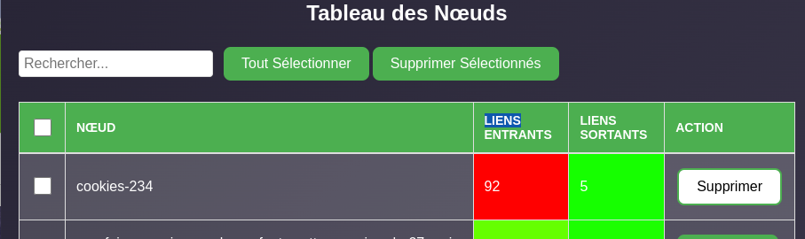

# Internal Mesh

## Prérequis

Assurez-vous d'avoir installé :
- [Docker](https://www.docker.com/products/docker-desktop)
- [ddev](https://ddev.readthedocs.io/en/stable/#installation)

## Étape 1 : Cloner le dépôt GitHub

1. **Ouvrez votre terminal.**
2. **Cloner le dépôt** :

   ```bash
   git clone https://github.com/friteuseb/internal_mesh.git
   ```

3. **Naviguez dans le répertoire cloné** :

   ```bash
   cd internal_mesh
   ```

## Étape 2 : Initialiser et Configurer ddev

1. **Initialisez ddev dans le répertoire du projet** :

   ```bash
   ddev config
   ```

   Vous serez invité à répondre à quelques questions :

   - **Project name** : `internal_mesh` (ou tout autre nom de votre choix)
   - **Docroot location** : `.`
   - **Project Type** : `php`

2. **Démarrer ddev** :

   ```bash
   ddev start
   ```
   Cette commande va télécharger les images Docker nécessaires et configurer votre environnement.

## Étape 3 : Accéder à l'Application

1. **Accéder à l'application via le navigateur** :
   
   Après avoir démarré ddev, vous verrez une URL semblable à `http://internal_mesh.ddev.site`. Ouvrez cette URL dans votre navigateur pour accéder à l'application.

## Étape 4 : Utiliser et Tester l'Application

Maintenant que votre environnement est configuré et l'application est en cours d'exécution, vous pouvez commencer à l'utiliser et à effectuer des tests.

## Étape 5 : Réaliser un export avec Screaming Frog

1. Configurez Screaming Frog en anglais (les exports sont traduits et les autres langues ne sont pas encore prises en compte).
   
2. Scannez votre site et supprimez éventuellement les pages qui ne vous intéressent pas. (L’application élimine automatiquement les liens images, js, css et ne conserve que les liens HTML. Vous pouvez donc éventuellement supprimer les pages qui ne servent à rien, et si vous voulez alléger l’export, les autres liens aussi).
   
3. Réalisez un export de tous les liens (Bulk Export) et sauvegardez-le en CSV.
   

4. Importer le CSV dans l’application puis cliquez sur “Télécharger et Traiter”.
   

5. L’outil va maintenant automatiquement filtrer le CSV pour ne conserver que les liens HTML (vers des pages) de type 200 (correct) et qui se trouvent dans le contenu, pour que le maillage ne soit pas faussé par les liens dans les menus.
   

6. Il s’agit maintenant de trier les pages avec le plus de liens entrants en cliquant sur la colonne “LIENS ENTRANTS” afin de pouvoir supprimer les pages qui ne sont pas pertinentes pour le maillage interne de vos contenus.
   

7. Continuez jusqu'à pouvoir observer votre maillage, utilisez le tableau pour identifier les pages qui nécessitent un travail de maillage !


## Commandes Utiles de ddev

- **Démarrer le projet** :

  ```bash
  ddev start
  ```

- **Arrêter le projet** :

  ```bash
  ddev stop
  ```

- **Ouvrir une session shell dans le conteneur web** :

  ```bash
  ddev ssh
  ```

- **Exécuter des commandes dans le conteneur web** :

  ```bash
  ddev exec <commande>
  ```

## Résumé

1. Cloner le dépôt GitHub.
2. Initialiser ddev dans le répertoire cloné.
3. Démarrer ddev.
4. Accéder à l'application via le navigateur.

